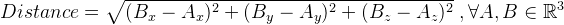
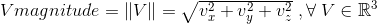
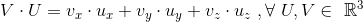
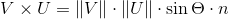
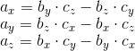
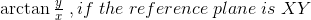
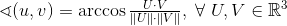

# Physics C++ · [](https://travis-ci.com/gramanicu/physicsCpp) [](https://app.codacy.com/app/gramanicu/physicsCpp?utm_source=github.com&utm_medium=referral&utm_content=gramanicu/physicsCpp&utm_campaign=Badge_Grade_Dashboard) [](https://opensource.org/licenses/MIT)

This is a C++ project that focuses on implementing vectors and points, used in physics. It is based on a [processing tutorial](https://processing.org/tutorials/pvector/) by Daniel Shiffman.

## Point

Implementation of the `Point` Class, on which the `Vector` Class is based. It has 3 variables of type `double`, x, y, z, which represent a position.
Most of it's methods are getters and setters, except from the `distance` method.

### Point.h

```c
static double distance(Point p1, Point p2)
```

### Point.cpp

```c
double Point::distance(Point p1, Point p2) {
    return sqrt(pow(p2.x - p1.x, 2) + pow(p2.y - p1.y, 2) +
                pow(p2.z - p1.z, 2));
}
```

To calculate the distance it uses the **_Distance Formula_**, which is derived from the **_Pythagorean Theorem_**.



Even if the point had **3 dimensions** defined, it can work using **only two**, the x & y without problem. Thats why one of the initializers has only **2 arguments**.

## PVector

The `PVector` represents a vector used in physics, to represent things like velocity, acceleration etc.. This class inherits all attributes and methods of the `Point` class.
The only changed method is the distance method, who has PVectors as arguments.

```c
double distance(Point) = delete;
```

However, the `PVector` class has a lot of new methods, created to do operations with vectors or calculate some of their proprieties, as well as a new attribute, called "`maxMagnitude`"

All **non-static methods** that return a `PVector` are changing the `PVector` object that is **calling them** & they return a copy of it.

-   `PVector add(PVector v)` - add a vector to the current one
-   `PVector subtract(PVector v)` - subtracts a vector from the current one
-   `PVector multiply(double scale)` - multiplies the vector with a scalar
-   `PVector divide(double scale)`- divides the vector with a scalar
-   `double distance(PVector v)` - calculates the distance between the current vector and another one
-   `double magnitude()`- calculates the length of the vector ( or '**magnitude**' )
-   `double getLimit()` - returns the vectors limit ( or '`maximum magnitude`' )
-   `PVector normalize()` - **normalises** the vector ( the magnitude will be 1 )
-   `PVector limit()` - assures that the vector magnitude is less than the `maxMagnitude`
-   `PVector limit(double max)` - sets the max magnitude attribute
-   `double headingXY()` - determines the vector orientation in the **XY** plane ( respectively, **XZ** & **YZ** plane ), in radians
-   `double headingDegXY()` - determines the vector orientation in the **XY** plane ( respectively, **XZ** & **YZ** plane ), in degrees
-   `double angleWith(PVector v)` - calculates the angle between the current vector and another one, in radians
-   `double angleDegWith(PVector v)` - calculates the angle between the current vector and another one, in degrees
-   `double dot(PVector v)` - calculates the 'dot' ( **_scalar_** ) product between the current vector and another one
-   `PVector cross(PVector v)` - calculates the 'cross' ( _**vectorial**_ ) product between the current vector and another one
-   `PVector divideNoLimit(double scale)` - divides the vector with a scalar _( this method is private, and it is used because it ignores the limit/maxMagnitude. The limit method needs to divide the vector, and the program would have entered a loop without this kind of function )_.

To ensure that the `PVector` object is not changed, the _static methods **must** be used_.

**The following** static methods have **overloads**. If it has two arguments, the **first one** will be the **result** of the operation. If it has three arguments, the last will be the result.

-   `add`
-   `subtract`
-   `cross`

The next are **not** overloaded, the `PVector` argument being the `PVector` returned:

-   `multiply`
-   `divide`

### PVectors.cpp - a few important notes

Any method that changes the object that is calling it **will** check if the new vector magnitude is lower than the max magnitude.

The `divide()` method _will avoid division with 0_, even if it isn't so much of a problem with variables of the `double` type.

**`void magnitude()`**

To calculate the **magnitude** of a vector, the **_following formula_** is used:



**`double dot(PVector, PVector v)`**

To calculate the **dot product** ( _scalar product_ ) of two vectors, the **_following formula_** is used:



**`void cross(PVector, PVector)`**

To calculate the **cross product** ( _vectorial product_ ) of two vectors, the **cross product formula** couldn't be used



So, the **scalar components ( x, y, z )** need to be calculated _one by one_ with the following formula, which is easier to implement:



**`void normalize()`**

To _normalize_ the vector (**give him a magnitude of 1**), he is divided by his own magnitude.

A similar method is used to give any vector a specific magnitude ( _it is divided with his magnitude divided by the desired magnitude_ ).

**`double heading..()`**

Calculates **angles** (_of one vector_), in reference to **any** plane, using the following formula:



To find the angle in degrees, the angle in radians is **multiplied with 180 and divided by PI** ( _`M_PI` = 3.14159265358979323846_ )

**`double angleWith(PVector, PVector)`**

Calculates the **angle between two vectors**, using the following formula



© 2019 Grama Nicolae
